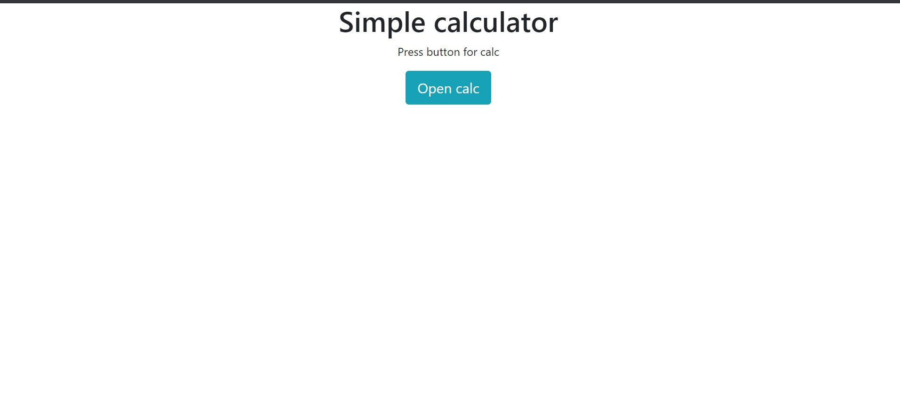
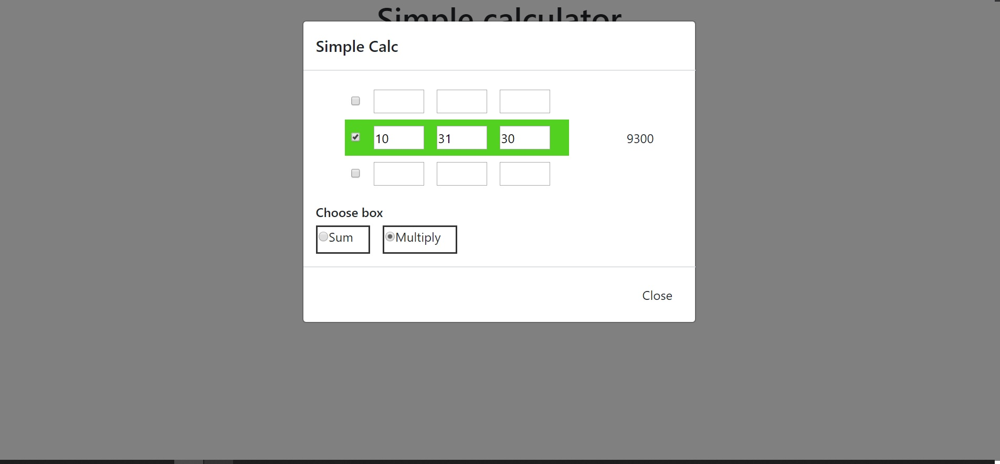

# Simple calculator

Simple calculator give you the ability to sum or multiply sequence of numbers and see a result for each row from the sketch presented below.

### technologies used

* [Twitter Bootstrap];
* [SASS];
* [JQuery]

### Demo

---

1.  **Home page**
    

2.  **Menu with multiply**
    

### Installation

If you want to continue codding:

1. Clone the repo: `git clone https://github.com/valerasamoylov/react-mongodb-app.git`
2. Select a directory: `cd react-mongodb-app`

[Twitter Bootstrap]: https://getbootstrap.com/
[SASS]: https://sass-lang.com/
[Jquery]: https://jquery.com/
